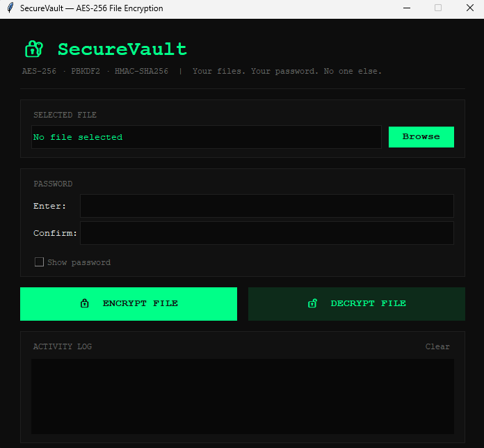

# 🔐 SecureVault

A desktop application for encrypting and decrypting files securely using AES-256 encryption, built with Python and Tkinter.

---

## 📋 Project Description

SecureVault is a cybersecurity-focused desktop application that allows users to encrypt any file (PDF, JPG, DOCX, PNG, etc.) using a password and decrypt it back using the same password. It uses industry-standard cryptographic techniques to ensure files are protected against brute-force attacks, tampering, and pattern analysis.

---

## ✨ Features

- Encrypt any file type (PDF, JPG, DOCX, PNG, TXT, and more)
- Decrypt encrypted `.enc` files back to their original format
- AES-256-CBC encryption — industry standard, never cracked
- PBKDF2 key derivation with 100,000 iterations — brute-force resistant
- HMAC-SHA256 authentication — detects tampering before decryption
- Random salt and IV generated for every encryption — defeats pattern attacks
- Brute-force lockout after 3 wrong password attempts
- Clean dark-themed desktop GUI built with Tkinter
- All encrypted files saved neatly to `encrypted_files/` folder

---

## 🛠️ Technologies Used

- Python 3
- Tkinter — GUI framework
- PyCryptodome — AES encryption, PBKDF2 key derivation, padding
- HMAC (Python standard library) — file integrity verification
- Hashlib (Python standard library) — SHA-256 hashing
- OS & Sys (Python standard library) — file handling and system operations

---

## 📁 Project Structure
securevault-1/
│
├── ui.py                        # Main GUI — all buttons, layout, and user interaction
│
├── core/
│   ├── init.py
│   ├── key_manager.py           # Password → AES-256 key using PBKDF2 + random salt
│   ├── encryptor.py             # AES-256-CBC encryption + HMAC generation
│   └── decryptor.py             # HMAC verification + AES-256-CBC decryption
│
├── utils/
│   ├── init.py
│   ├── file_handler.py          # Builds input/output file paths automatically
│   └── validator.py             # Input validation + wrong attempt lockout
│
├── encrypted_files/             # All .enc files are saved here automatically
│
└── requirements.txt             # Project dependencies

---

## ▶️ How To Run

**1. Clone or download the project**

**2. Create and activate virtual environment**
```bash
python -m venv .venv
.venv\Scripts\activate
```

**3. Install dependencies**
```bash
pip install pycryptodome
```

**4. Create the encrypted files folder**
```bash
mkdir encrypted_files
```

**5. Run the application**
```bash
python ui.py
```

---

## 🔒 Security Concepts Used

- **AES-256-CBC** — Advanced Encryption Standard with 256-bit key in Cipher Block Chaining mode
- **PBKDF2** — Password-Based Key Derivation Function 2, runs 100,000 SHA-256 iterations to slow brute-force attacks
- **Random Salt** — 16 bytes of randomness added to password before key derivation, defeats rainbow table attacks
- **IV (Initialization Vector)** — Fresh random 16 bytes generated every encryption, ensures identical files encrypt differently each time
- **HMAC-SHA256** — Cryptographic signature over the encrypted data, detects any tampering before decryption begins
- **Encrypt-then-MAC** — HMAC is calculated after encryption, the most secure ordering
- **Timing-safe comparison** — `hmac.compare_digest()` used instead of `==` to prevent timing attacks
- **Brute-force lockout** — Application exits after 3 wrong password attempts

---

## 🚀 Future Improvements

- Add a password strength checker before encryption
- Support encrypting entire folders at once
- Add a progress bar for large file encryption
- Implement a secure password manager to store hints
- Add file shredding — securely delete original after encryption
- Cross-platform packaging as a standalone `.exe` using PyInstaller
- Add drag-and-drop file support to the GUI

---

##  Screenshot


---

## 👤 Author

**Sara Ahmed**
Cybersecurity Project — SecureVault
Built with Python, PyCryptodome, and Tkinter


[def]: assets/ui_main.png